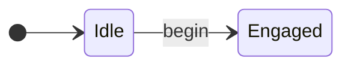
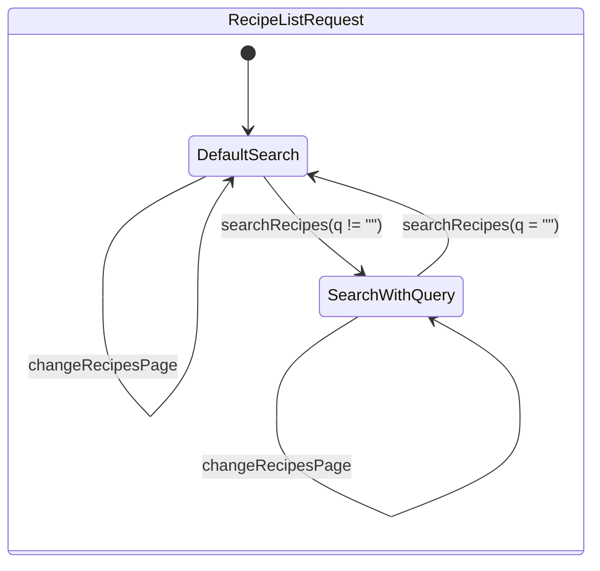
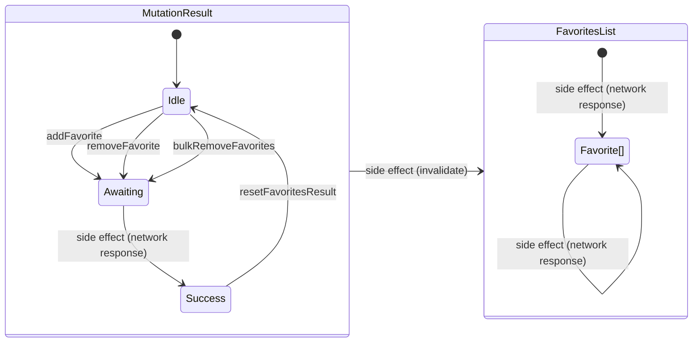

# Reactive Recipes

```
npm install
npm run dev
```

[Reactive Recipes](http://localhost:5173)


https://github.com/grancalavera/reactive-recipes/assets/301030/c7139949-7a51-489d-8965-a6627f61a170


## Useful links

- [json-server](https://github.com/typicode/json-server)
- [concurrently](https://github.com/open-cli-tools/concurrently)
- [RapidAPI](https://rapidapi.com)

## RapidAPI and Tasty

You need to create a [RapidAPI](https://rapidapi.com) account and subscribe to the [tasty](https://rapidapi.com/apidojo/api/tasty) API.

Create an `.env.local` file at the root of the project and add following fields:

```bash
VITE_RAPID_API_HOST=tasty.p.rapidapi.com
VITE_RAPID_API_KEY=<your api key>
```

Tasty has a very limited free account, so you may run out of requests quite quickly, use the [RapidAPI Dashboard](https://rapidapi.com/developer/dashboard) to monitor your usage.

## Mutations

Access to mutation results is global, but each mutation result requires a correlation id to be de-referenced. Using the [useId](https://react.dev/reference/react/useId) hook from within a React component, it is possible to virtually have "private" mutations, local only to the component that triggers them.

> For example, see [RemoveFavorite](src/favorites/RemoveFavorite.tsx).

## Signals and state

Imagine you want to transition between two states: `Idle` and `Engaged` using a `begin` transition:



You can use [signals](https://react-rxjs.org/docs/api/utils/createSignal) to represent and compose the transitions between states. If you create a signal:

```typescript
const [begin$, begin] = createSignal<void>();
```

Then `begin` becomes the public API that allows the user to trigger a state transition, and `begin$` the private API that allows you to compose state transitions with side effects and with other state transitions, to produce a new state of your application, or trigger a side effect in the system.

```typescript
type State = "Idle" | "Engaged";

const state$ = begin$.pipe(
  map(() => "Engaged" as const),
  startWith("Idle" as const)
);
```

After that, you can create a hook to allow React components consume the state of your application:

```typescript
const [useAppState] = bind(state$);
```

And finally you can export your public API, which should be your state transitions plus your state hooks:

```typescript
export { begin, useAppState };
```

The transitions for [`favorites/state.selection.ts`](src/favorites/state.selection.ts) are composed and transformed to represent the state a selection of favorite recipes, but they don't produce any side effect, apart from rendering.

The transitions for [`favorites/state.manage.ts`](src/favorites/state.manage.ts) produce side effects that eventually affect the value of the current list of [`Favorite`](src/favorites/service.model.ts) recipes[].

The transitions for [`recipes/state.ts`](src/recipes/state.ts) are a mix. First they transform an intermediate state called [`RecipeListRequest`](src/recipes/model.ts). Conceptually this state can be understood as follows:



That intermediate state represents the arguments for a service call. By composing `RecipeListRequest` with an observable service, we produce [`PaginatedRecipeListResult`](src/recipes/model.ts), which is the final state we want to offer as a public API of our application.

Is worth noting this composition has side effects (errors and network calls), but the result is exposed in the same resulting observable state. This is usually the case with read operations, but more often than not **is not the case with mutations**. As seen before, mutation usually have the common side effects (errors, network calls, asynchronicity), but on top of that their result may affect the emissions of other pieces of observable state.

For example, triggering the `addFavorite` transition in [`favorites/state.manage.ts`](src/favorites/state.manage.ts) emits the result of the mutation (`Result<string | string[]>`), which represents the IDs of the successfully manipulated `Favorite` objects. But additionally, it produces an emission of `Favorite[]` for all components using the `useFavorites` hook from the same file (errors are implicit and not shown).



## Todo

- [ ] Error handling.
- [ ] Representing mutations with [MutationResult](src/lib/mutation.ts) probably needs more work.
- [ ] Unit tests?
- [ ] Integration tests?
