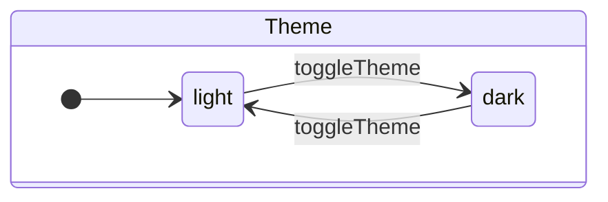
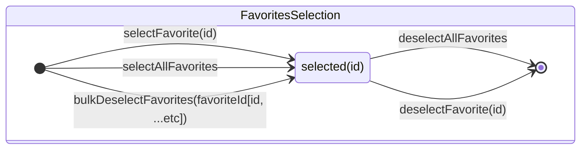
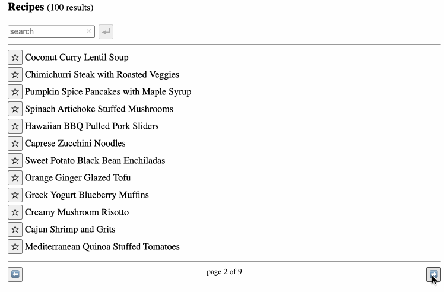
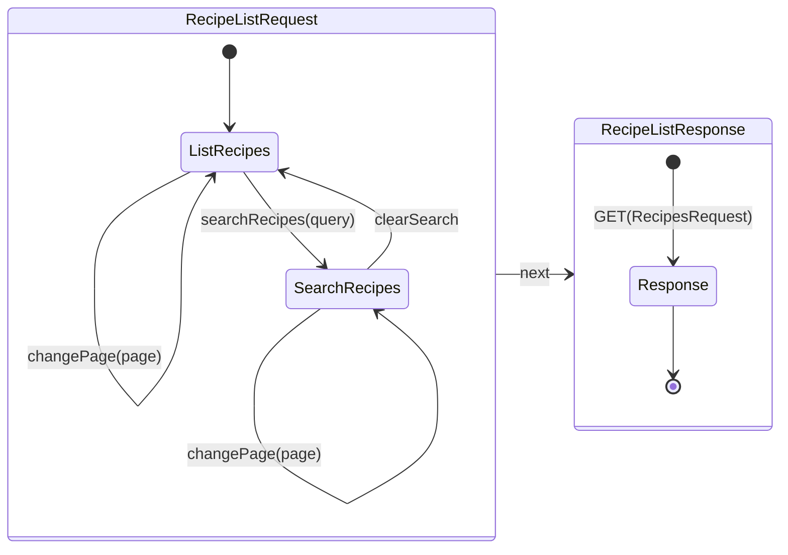

# Reactive Recipes

```
npm install
npm run dev
# then go to http://localhost:5173
```

https://github.com/grancalavera/reactive-recipes/assets/301030/c7139949-7a51-489d-8965-a6627f61a170

## Useful links

- [json-server](https://github.com/typicode/json-server): used to mock a REST API.
- [concurrently](https://github.com/open-cli-tools/concurrently): used to start npm tasks concurrently.

## Reference Material

- For an intuition on how to design functional services, read [Domain Modeling Made Functional](https://pragprog.com/titles/swdddf/domain-modeling-made-functional/)
- For an intuition on what is considered a side effect, and how to compose side effects, watch [Duality and the End of Reactive](https://youtu.be/SVYGmGYXLpY?si=SC6OFZWVsHUSIXEBb)
- For an introduction to using finite state machines to describe user interfaces, read [Statecharts: a visual formalism for complex systems](https://www.sciencedirect.com/science/article/pii/0167642387900359)

## State: A Simple Example

We're introducing the notion of state in the context of managing an application's theme. Our application must support two themes: _light_ and _dark_, a single operation to toggle between them, as well as providing a way to read the current theme. This is one of the ways to model such state:



We can interpret the state as follows:

1. The name of our state is `Theme`.
1. `Theme` is composed by two sub-states: `light` and `dark`.
1. The default sub-state is `light`.
1. There is a single _state transition_ named `toggleTheme`.
1. There is no terminal state.

With this interpretation in mind, we can start translating out state machine into an implementation:

1. The name of the state becomes the name of our "feature", and is used to create a directory for our files.
1. In this directory, a single `state.ts` file contains the implementation of our state machine.
1. We translate the state machine's top level state and sub states into a TypeScript type:
   ```typescript
   type Theme = "light" | "dark";
   ```
1. We translate the state transitions into React-RxJS signals:

   ```typescript
   const [toggleTheme$, toggleTheme] = createSignal();
   ```

1. We consume the observable part of the signal to produce an `Observable<Theme>` to share with the rest of our application:

   ```typescript
   const [useTheme, theme$] = bind(
     toggleTheme$.pipe(
       scan(
         (currentTheme) => (currentTheme === "light" ? "dark" : "light"),
         defaultState
       ),
       startWith(defaultState)
     )
   );
   ```

1. And finally we export our public API, which should consist in the **setters** of our signal, the **hooks** (and optionally the **observables** ) derived from consuming the signals:
   ```typescript
   export { toggleTheme, useTheme, theme$ };
   ```

> We keep the "observable" part of the signals private to our module, because they represent strictly user interaction that needs to be "interpreted" by our state machine in order to obtain meaning in our implementation. This should be the norm in most cases.
> The situation we want to avoid is to introduce _ambiguity_, where a single user interaction may be interpreted in more than 1 way by our application. In cases when the **result** of an user interaction is of global interest to our application, new states may be derived from the public state produced by the module.
> For example, if we want to log the theme in used by the application, we'd derive that side effect from the already interpreted `theme$` observable, and not from the `toggleTheme$` signal directly, since the meaning of `toggleTheme$` can get out of sync from the value of `theme$`.

## A Complex Example: Favorite Selection

This state manages the selected favorites in the favorites section, without making any changes to them directly. The state is exposed globally, and different parts of the application can operate over the selection.




### Implementation

> [favorites/state.selection.ts](./src/favorites-manager/state.ts)

The state is represented by a `FavoritesSelection` type, implemented using a [Set](https://developer.mozilla.org/en-US/docs/Web/JavaScript/Reference/Global_Objects/Set).

## Services: Parameterising Operations with State

`RecipeListRequest` is an intermediate state that represents the arguments for a service call. By composing the resulting`Observable<RecipeListRequest>` with an observable service, we produce [`RecipeListResponse`](src/recipes/model.ts), which is the final state we want to offer as a public API of our application.





## Mutations

- "atomicity": from and to a single component.
- single responsibility service.
- side effects composition on state layer.
- add and remove favorite
- bulk remove favorite

## Todo

- [ ] Error handling.
- [ ] Representing mutations with [MutationResult](src/lib/mutation.ts) probably needs more work.
