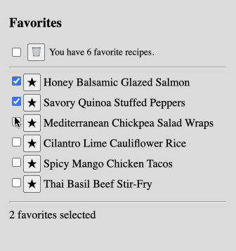

# Reactive Recipes

```
npm install
npm run dev
# then go to http://localhost:5173
```

https://github.com/grancalavera/reactive-recipes/assets/301030/c7139949-7a51-489d-8965-a6627f61a170

## Useful links

- [json-server](https://github.com/typicode/json-server): used to mock a REST API.
- [concurrently](https://github.com/open-cli-tools/concurrently): used to start npm tasks concurrently.

## Reference Material

- For an intuition on how to design functional services, read [Domain Modeling Made Functional](https://pragprog.com/titles/swdddf/domain-modeling-made-functional/)
- For an intuition on what is considered a side effect, and how to compose side effects, watch [Duality and the End of Reactive](https://youtu.be/SVYGmGYXLpY?si=SC6OFZWVsHUSIXEBb)
- For an introduction to using finite state machines to describe user interfaces, read [Statecharts: a visual formalism for complex systems](https://www.sciencedirect.com/science/article/pii/0167642387900359)

## State

Imagine you are working on an application that can be in two states: `Idle` and `Activated`. You can represent such application with a finite state machine:


Using the state machine as a guide, you can provide an implementation for your application's state by providing:

1. a type definition for the state
1. a set of transitions that transform the state
1. a hook that allows React components to consume the state

Begin by defining a type that allows you to represent your state, including all the possible sub-states:

```typescript
type State = "Idle" | "Activated";
```

Then, use [signals](https://react-rxjs.org/docs/api/utils/createSignal) to represent and compose the transitions between states. If you create a signal:

```typescript
const [activate$, activate] = createSignal<void>();
const [deactivate$, deactivate] = createSignal<void>();
```

`createSignal` returns tuple, with an observable on the first element and a setter function on the second element. Use the observable to compose your application's state, and export the setter as your state transitions public API. In this case, `activate` and `deactivate` become the public API that allows the user to trigger a state transition, and `activate$` and `deactivate$` the private API that allows you to compose state transitions to produce a new state of your application.

For example, this is a possible implementation of our application's state:

```typescript
const state$ = merge(
  activate$.pipe(map(() => "Activated" as const)),
  deactivate$.pipe(map(() => "Idle" as const))
).pipe(startWith("Idle"));
```

> Notice that our state transition functions do not carry a value in this case. Arguably we could implement our state
> transitions with a single signal:
>
> `const [transition$, setTransition] = createSignal<State>()`.
>
> But we want to highlight the importance of the **meaning** of each state transition. As much as possible, your public
> API should represent your "ideal" state machine without showing the implementation details.
>
> Later on we will show how sometimes it makes sense to carry data along with a state transition.

After that, you can create a hook to allow React components consume the state of your application:

```typescript
const [useAppState, appState$] = bind(state$);
```

And finally you can export your public API, which should be your state transitions plus your state hooks:

```typescript
export { activate, deactivate, useAppState, appState$ };
```

> `appState$` is the underlying StateObservable behind the `useAppState` hook. This observable is multicast and shared, an you can use it to compose your state with other observables in other parts of your application. I like to recommend only adding to your public API observables that represents state in your application, and carry meaning in your business, rather than using the observable returned by signals. This is because signals are implementation details for a concrete state machine, and you may want to change them in the future, while the state should be a stable concept in your business.

### Example 1 simple state: favorite selection

> [favorites/state.selection.ts](./src/favorites/state.selection.ts)

This state manages the selected favorites in the favorites section, without making any changes to them directly. The state is exposed as global states, and different parts of the application can operate over the selection.



The state is represented by a `FavoritesSelection` type, implemented using a [Set](https://developer.mozilla.org/en-US/docs/Web/JavaScript/Reference/Global_Objects/Set). All state transitions start and end in the same state, but the Set can be empty. There's no need to represent the empty set as an independent state.

> [favorites-manager/state.ts](./src/favorites-manager/state.ts)


### Example 2, state with sub states: listing and searching recipes

`RecipeListRequest` is an intermediate state that represents the arguments for a service call. By composing the resulting`Observable<RecipeListRequest>` with an observable service, we produce [`RecipeListResponse`](src/recipes/model.ts), which is the final state we want to offer as a public API of our application.


## Mutations

- "atomicity": from and to a single component.
- single responsibility service.
- side effects composition on state layer.
- add and remove favorite
- bulk remove favorite

## Todo

- [ ] Error handling.
- [ ] Representing mutations with [MutationResult](src/lib/mutation.ts) probably needs more work.
