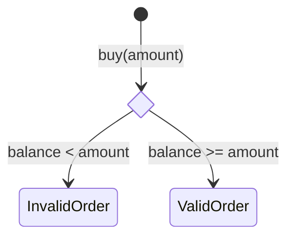

```mermaid
stateDiagram-v2

state account_balance <<choice>>
state "InvalidOrder" as invalid
state "ValidOrder" as valid

[*] --> account_balance: buy(amount)
account_balance --> invalid: balance < amount
account_balance --> valid: balance >= amount
```
