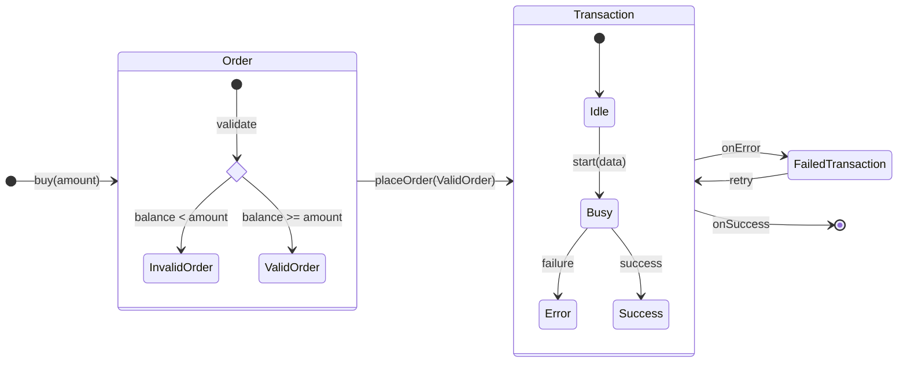

```mermaid
stateDiagram-v2
direction LR

[*] --> Order: buy(amount)
Order --> Transaction: placeOrder(ValidOrder)
Transaction --> FailedTransaction: onError
FailedTransaction --> Transaction: retry
Transaction --> [*]: onSuccess

state Order {
  state account_balance <<choice>>
  state "InvalidOrder" as valid
  state "ValidOrder" as invalid

  [*] --> account_balance: validate
  account_balance --> valid: balance < amount
  account_balance --> invalid: balance >= amount
}

state Transaction {
  [*] --> Idle
  Idle --> Busy: start(data)
  Busy --> Error: failure
  Busy --> Success: success
}
```
